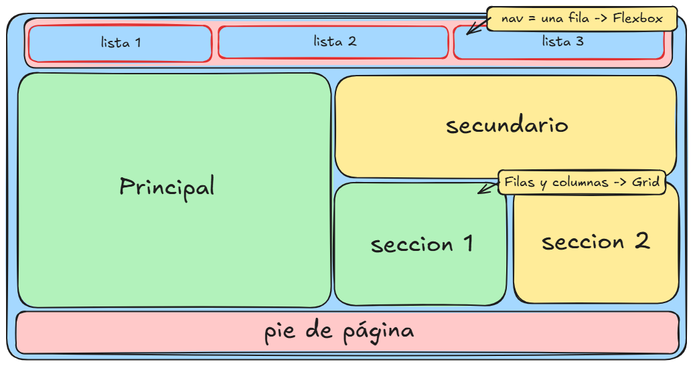

# TechMarket — Layout y reflexión

## ¿En qué parte usamos Grid y por qué?

Usamos **Grid** en el contenedor general `.layout`, el que envuelve toda la página. Ahí definimos `grid-template-columns` y `grid-template-areas` para ubicar de una sola vez la barra de navegación (lista), el bloque principal, el secundario, las dos secciones (AirPods e iPhone) y el pie de página.

Elegimos Grid porque este layout tiene **filas y columnas al mismo tiempo**: por ejemplo, "Principal" ocupa dos filas de alto mientras que a su lado "secundario" está arriba y "seccion 1"/"seccion 2" están abajo, repartiéndose el mismo ancho. Eso es exactamente un problema bidimensional (filas + columnas), y Grid es la herramienta pensada para resolver el layout general de una página con esa estructura, en lugar de estar anidando contenedores para lograrlo.

## ¿En qué parte usamos Flexbox y por qué?

Usamos **Flexbox** en dos lugares puntuales:

1. En `.lista`, la barra de navegación superior (Productos, Ofertas, Contacto). Ahí solo necesitábamos alinear **una sola fila** de elementos, repartidos en el mismo ancho (`flex: 1` en cada ítem).
2. Dentro de cada caja de contenido (`.principal`, `.secundario`, `.seccion`, `.pie`) para centrar verticalmente y horizontalmente el texto/título/imagen dentro de la caja.

Elegimos Flexbox en estos casos porque son problemas de **una sola dimensión**: una fila de botones, o el centrado de contenido dentro de un único contenedor. No había que coordinar filas y columnas a la vez, así que Flexbox es más simple y directo que Grid para esto.

En la terminal, dentro de la carpeta del proyecto, ejecuta:
 
```bash
bash start.sh
```
 
Esto levanta un servidor local en `http://localhost:8000`. Si estás en un Codespace, abre el puerto 8000 desde la pestaña **PORTS** o desde la notificación que aparece abajo a la derecha.
 
